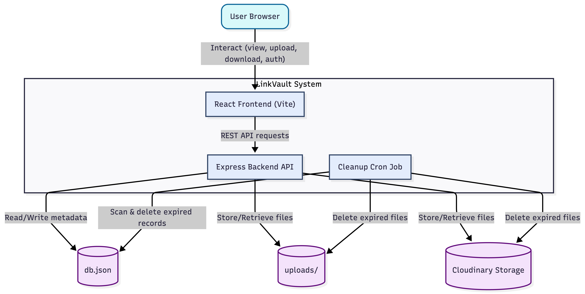
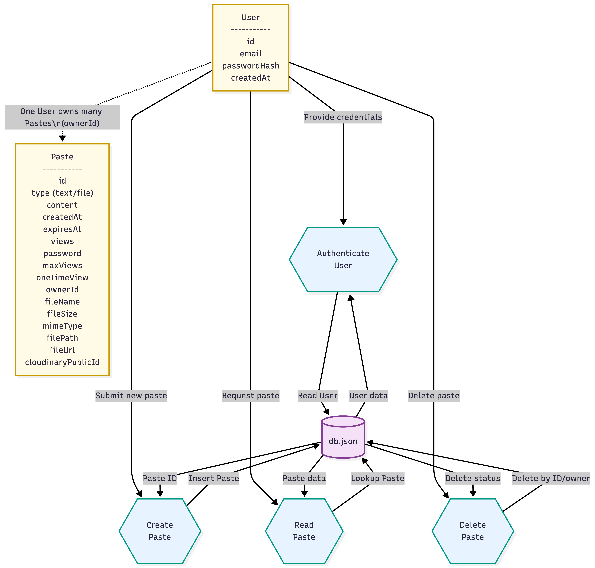
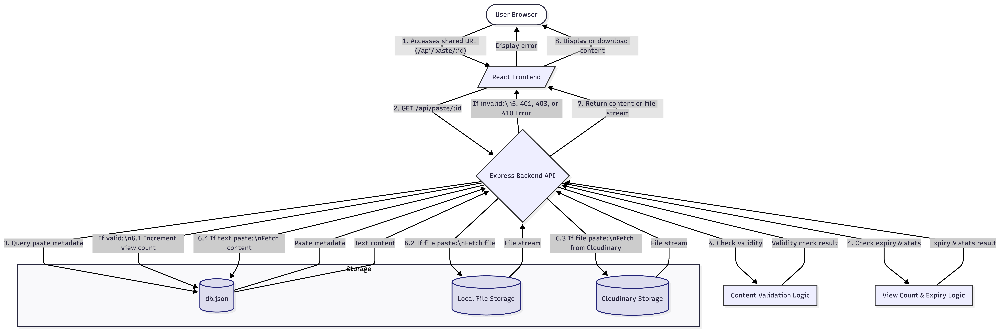
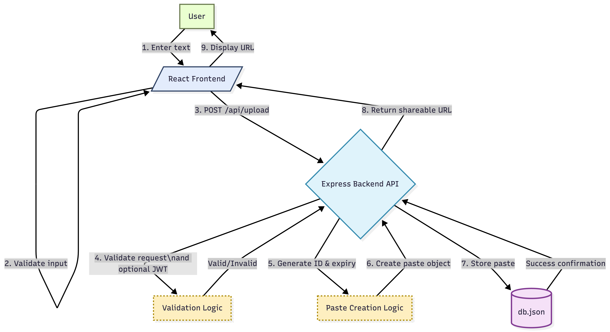
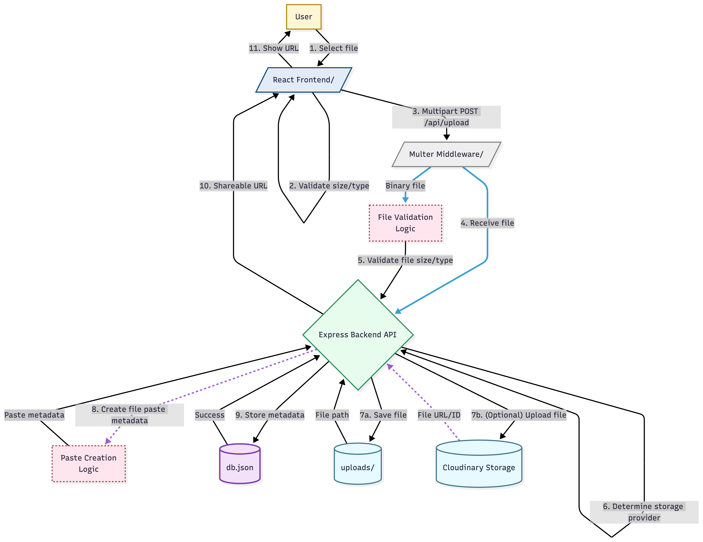

# LinkVault - System Architecture

## Overview

LinkVault is a full-stack web application built with a React frontend and an Express backend. It supports link-based sharing of text or files with expiry, optional password protection, view limits, and one-time view.

## Component Architecture

No component-architecture image was added in `dfd/`, so this section uses a Mermaid diagram.

```mermaid
flowchart LR
  subgraph Frontend[Frontend (React + Vite)]
    App[App Router]
    Home[Home (Upload)]
    View[ViewPaste (View/Download/Delete)]
    Login[Login]
    Register[Register]
    Api[services/api.js (Axios client)]
    App --> Home
    App --> View
    App --> Login
    App --> Register
    Home --> Api
    View --> Api
    Login --> Api
    Register --> Api
  end

  subgraph Backend[Backend (Node.js + Express)]
    UploadRoute[POST /api/upload]
    PasteRoute[GET /api/paste/:id]
    DownloadRoute[GET /api/download/:id]
    DeleteRoute[DELETE /api/paste/:id]
    AuthRegister[POST /api/auth/register]
    AuthLogin[POST /api/auth/login]
    AuthMe[GET /api/auth/me]
  end

  subgraph Storage[Storage]
    DB[(JSON DB: backend/data/db.json)]
    Local[(Uploads: backend/uploads/)]
    Cloud[(Cloudinary - optional)]
  end

  Api --> UploadRoute
  Api --> PasteRoute
  Api --> DownloadRoute
  Api --> DeleteRoute
  Api --> AuthRegister
  Api --> AuthLogin
  Api --> AuthMe

  UploadRoute --> DB
  PasteRoute --> DB
  DeleteRoute --> DB
  DownloadRoute --> Local
  UploadRoute --> Local
  UploadRoute -. optional .-> Cloud
  DownloadRoute -. optional .-> Cloud
```

## High-Level System Architecture



## Database Schema



## Content Access Flow (Low-Level)



## Upload Flow (Text)



## Upload Flow (File)




## Technology Stack

### Frontend
- **React 18.2**: Modern UI library with hooks
- **Vite**: Fast build tool and dev server
- **React Router 6**: Client-side routing
- **Tailwind CSS 3**: Utility-first CSS framework
- **Axios**: Promise-based HTTP client
- **Lucide React**: Modern icon library

### Backend
- **Node.js**: JavaScript runtime
- **Express.js 4.18**: Web application framework
- **Multer**: Multipart/form-data handling
- **nanoid 3**: Unique ID generation
- **node-cron**: Scheduled task runner
- **CORS**: Cross-Origin Resource Sharing
- **dotenv**: Environment variable management

### Storage
- **JSON Database**: Simple file-based data storage (`backend/data/db.json`)
- **File Storage**: Local file storage for uploads (`backend/uploads/`)
- **Optional**: Cloudinary can be enabled via env vars (files are also stored locally as a fallback for reliable downloads)

## Data Flow

### 1. Upload Flow (Text)

```
User Input → Frontend Validation → API Request → Backend Validation
    ↓
Generate Unique ID (nanoid)
    ↓
Create Paste Object
    ↓
Calculate Expiry Time
    ↓
Store in Database (db.json)
    ↓
Return URL to User
```

### 2. Upload Flow (File)

```
User File Selection → Frontend Validation → Multipart Upload
    ↓
Multer Middleware
    ↓
File Saved to ./uploads/
    ↓
Generate Unique ID
    ↓
Create Paste Object (with file metadata)
    ↓
Store in Database
    ↓
Return URL to User
```

### 3. View Flow

```
User Accesses URL → Extract ID → Check Database
    ↓
Paste Found?
    ├─ No → 404 Error
    └─ Yes → Check Expiry
              ↓
         Expired?
         ├─ Yes → Delete & 410 Error
         └─ No → Check Password
                  ↓
            Password Protected?
            ├─ Yes → Verify Password
            │        ↓
            │   Valid?
            │   ├─ No → 401 Error
            │   └─ Yes → Continue
            └─ No → Continue
                     ↓
               Check Max Views
                     ↓
               Limit Reached?
               ├─ Yes → Delete & 410 Error
               └─ No → Increment View Count
                        ↓
                   One-Time View?
                   ├─ Yes → Schedule Deletion
                   └─ No → Continue
                            ↓
                       Return Content
```

### 4. Cleanup Flow

```
Cron Job (Every Minute)
    ↓
Query Database for Expired Pastes
    ↓
For Each Expired Paste:
    ├─ Delete File (if exists)
    └─ Delete Database Entry
```

## Database Schema

### Paste Object Structure

```javascript
{
  id: string,              // Unique identifier (nanoid)
  type: 'text' | 'file',   // Content type
  createdAt: string,       // ISO timestamp
  expiresAt: string,       // ISO timestamp
  views: number,           // View counter
  password: string | null, // Optional password
  maxViews: number | null, // Optional view limit
  oneTimeView: boolean,    // Self-destruct flag
  ownerId: string | null,  // If set, only the owner can delete
  
  // For text pastes:
  content: string,         // Text content
  
  // For file pastes:
  fileName: string,        // Original filename
  fileSize: number,        // Size in bytes
  mimeType: string,        // File MIME type
  filePath: string,        // Server file path
  fileUrl: string | null,  // Cloud URL if using Cloudinary
  cloudinaryPublicId: string | null,
  cloudinaryResourceType: string | null,
  cloudinaryDeliveryType: string | null,
  cloudinaryVersion: number | null
}
```

### User Object Structure

```javascript
{
  id: string,
  email: string,
  passwordHash: string,
  createdAt: string
}
```

### Database File (db.json)

```json
{
  "pastes": [
    {
      "id": "K8xY2mNpQ1",
      "type": "text",
      "content": "Hello, World!",
      "createdAt": "2024-01-01T12:00:00.000Z",
      "expiresAt": "2024-01-01T12:10:00.000Z",
      "views": 5,
      "password": null,
      "maxViews": null,
      "oneTimeView": false,
      "ownerId": null
    }
  ],
  "users": [
    {
      "id": "user_123",
      "email": "user@example.com",
      "passwordHash": "$2a$10$...",
      "createdAt": "2024-01-01T12:00:00.000Z"
    }
  ]
}
```

## Security Measures

### 1. Access Control
- No public listing of pastes
- Content only accessible via exact URL
- Unique, unpredictable IDs (nanoid with 10 characters = 64^10 combinations)

### 2. Password Protection
- Optional password requirement
- Password verified before content access
- Paste-password protection compares the provided password with the stored value for that paste
- User account passwords are stored as a bcrypt hash

### 3. Auto-Expiry
- All pastes have expiration date
- Automatic cleanup via cron job
- Expired content returns 410 Gone

### 4. View Limits
- Optional maximum view count
- Automatic deletion after limit reached
- One-time view option for sensitive data

### 5. File Upload Security
- File size validation (default 10MB)
- Server-side validation
- Unique file names to prevent collisions
- CORS configuration

### 6. Input Validation
- Frontend validation for UX
- Backend validation for security
- Type checking on all inputs
- Sanitization of file names

## API Design

### RESTful Principles
- Resource-based URLs (`/api/paste/:id`)
- HTTP methods match operations (GET, POST, DELETE)
- Stateless operations
- JSON responses
- Proper HTTP status codes

### Status Codes Used
- `200 OK`: Successful GET/DELETE
- `201 Created`: Successful upload
- `400 Bad Request`: Invalid input
- `401 Unauthorized`: Wrong password
- `404 Not Found`: Paste doesn't exist
- `410 Gone`: Expired/limit reached
- `413 Payload Too Large`: File too big
- `500 Internal Server Error`: Server error

### Error Response Format
```json
{
  "error": "Error message",
  "message": "Additional details (dev mode only)"
}
```

## File Storage Strategy

### Current Implementation
- Local file system storage
- Files stored in `./uploads/` directory
- Unique file names: `{nanoid}-{originalName}`
- Files deleted when paste expires or is deleted

### Production Recommendations
- Use cloud storage (AWS S3, Google Cloud Storage)
- Implement CDN for faster downloads
- Add virus scanning for uploaded files
- Implement redundancy/backups

## Scalability Considerations

### Current Limitations
1. **File-based database**: Not suitable for high concurrency
2. **Local storage**: Limited by disk space
3. **No caching**: Every request hits database
4. **Single process**: No horizontal scaling


## Development Guidelines

### Code Structure
```
LinkVault/
├── backend/          # Express app & storage
│   ├── server.js     # Express app & routes
│   └── database.js   # Database operations
└── frontend/         # React frontend
    ├── src/
    │   ├── components/    # React components
    │   ├── services/      # API clients
    │   ├── hooks/         # Custom hooks
    │   └── utils/         # Helper functions
    └── public/       # Static assets
```


## Deployment Architecture

### Development
```
Developer Machine
├── Backend: localhost:5000
└── Frontend: localhost:3000 (Vite dev server)
```

### Production (Recommended)
```
Internet
    ↓
Load Balancer (Nginx)
    ↓
    ├──→ Frontend (Static CDN - Vercel/Netlify)
    └──→ Backend API (Node.js - Heroku/Railway/AWS)
            ↓
            ├──→ Database (PostgreSQL - AWS RDS)
            └──→ File Storage (AWS S3)
```

## Conclusion

LinkVault provides a solid foundation for a file-sharing application with room for growth. The modular architecture makes it easy to scale and add features as needed.

Key strengths:
- Clean separation of concerns
- RESTful API design
- Security-focused features
- Easy to understand and modify
- Production-ready structure

Areas for improvement:
- Database migration for better scaling
- Cloud storage integration
- Enhanced security (password hashing, rate limiting)
- Comprehensive monitoring
- Automated testing
